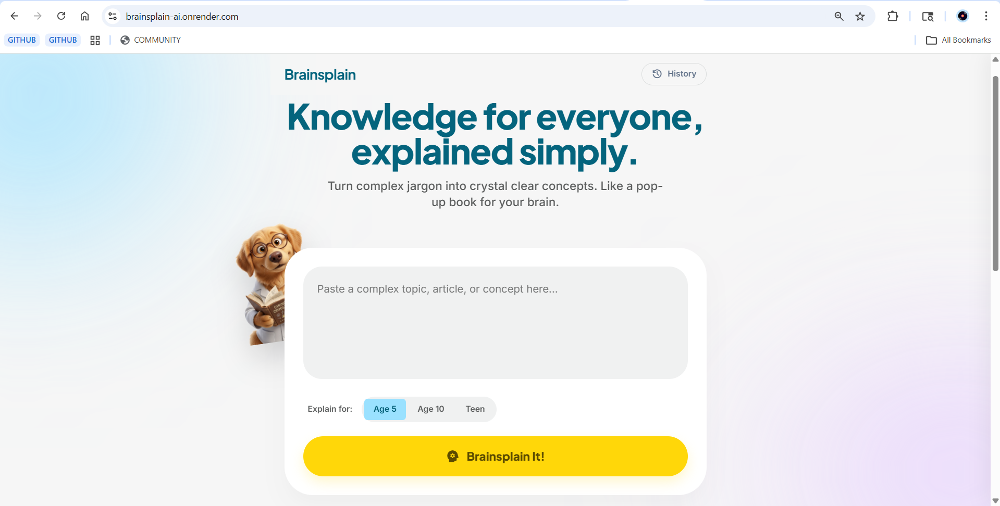

<div align="center">

<!-- BANNER — save banner.svg inside screenshots/ folder in your repo -->


<br/><br/>
<p align="center">
  <em>"Turn complex jargon into crystal clear concepts. Like a pop-up book for your brain."</em>
</p>
<br/>

<a href="https://brainsplain-ai.onrender.com/" target="_blank">
  
</a>

<br/><br/>


</div>

---

## 📸 Screenshots

<div align="center">

| 🏠 Homepage |
|:-----------:|
|  |

</div>


---

## 🎬 Demo Video

<div align="center">

[](https://youtube.com)

> 📌 Record a 30–60 sec walkthrough on [Loom](https://loom.com) or OBS, then replace the link above.

</div>

---

## ✨ What is Brainsplain?

**Brainsplain** is a web app that takes any complex topic — a scientific concept, a news article, a confusing technical term — and explains it in plain, engaging language using Google's Gemini AI.

Choose your explanation level:

| Level | What it feels like |
|-------|--------------------|
| 🧒 **Age 5** | A bedtime story — emojis, fun analogies, pure simplicity |
| 🧑 **Age 10** | Clear and engaging — like a cool teacher explaining it |
| 🧑‍🎓 **Teen** | Conversational, accurate, completely jargon-free |

The app also keeps a **History** of your past explanations so you can revisit them anytime.

---

## 🚀 Features

- 🧠 **AI-Powered** — Google Gemini generates smart, contextual simplifications
- 🎚️ **3 Explanation Levels** — Age 5, Age 10, Teen — each with a tailored system prompt
- 🕓 **Explanation History** — Revisit your past queries anytime
- ⚡ **Fast Results** — Explanations generated in seconds
- 📱 **Fully Responsive** — Clean experience on mobile and desktop
- 🐳 **Dockerized** — Runs consistently anywhere with Docker
- 🔒 **Secure** — API key stored as an environment variable, never in code
- 🌐 **Live on Render** — [brainsplain-ai.onrender.com](https://brainsplain-ai.onrender.com)

---

## 🛠️ Tech Stack

| Layer | Technology |
|-------|-----------|
| **Frontend** | HTML, CSS, JavaScript |
| **Backend** | Python · Flask · Flask-CORS |
| **AI Engine** | Google Gemini API (`gemini-flash-latest`) |
| **Config** | python-dotenv |
| **Containerization** | Docker |
| **Deployment** | Render |

---

## 📁 Project Structure

```
Brainsplain-ai/
│
├── 📂 backend/                # Flask API server
│   ├── app.py                 # Main server — routes & Gemini integration
│   ├── requirements.txt       # Python dependencies
│   └── .env                   # API key (local only — never commit)
│
├── 📂 frontend/               # Static frontend
│   ├── index.html             # Main page
│   ├── style.css              # Styling & gradient design
│   └── script.js              # Frontend logic & API calls
│
├── 📄 Dockerfile              # Docker config for unified deployment
├── 📄 .gitignore              # Keeps .env out of GitHub
└── 📄 README.md
```

---

## ⚙️ Run Locally

### Option A — Without Docker

#### Prerequisites
- Python 3.8+
- A Google Gemini API key from [aistudio.google.com](https://aistudio.google.com)

```bash
# 1. Clone the repo
git clone https://github.com/kartikbansalx/Brainsplain-ai.git
cd Brainsplain-ai/backend

# 2. Create a virtual environment
python -m venv venv
source venv/bin/activate        # Windows: venv\Scripts\activate

# 3. Install dependencies
pip install -r requirements.txt

# 4. Create your .env file
echo "Gemini_API_KEY=your_actual_api_key_here" > .env

# 5. Start the server
python app.py
```

Open **http://localhost:5000** in your browser. 🎉

---

### Option B — With Docker 🐳

```bash
# 1. Clone the repo
git clone https://github.com/kartikbansalx/Brainsplain-ai.git
cd Brainsplain-ai

# 2. Build the Docker image
docker build -t brainsplain .

# 3. Run the container
docker run -p 5000:5000 -e Gemini_API_KEY=your_key_here brainsplain
```

Open **http://localhost:5000** in your browser. 🎉

---

## 🌐 Deploy on Render

1. Push your code to GitHub *(ensure `.env` is in `.gitignore`)*
2. Go to [render.com](https://render.com) → **New Web Service**
3. Connect your repo: `kartikbansalx/Brainsplain-ai`
4. Configure the service:

| Setting | Value |
|---------|-------|
| **Build Command** | `pip install -r backend/requirements.txt` |
| **Start Command** | `python backend/app.py` |
| **Environment Variable** | `Gemini_API_KEY` → your key |

5. Click **Deploy** — your site goes live in ~2 minutes ✅

> 💡 If using the Dockerfile, select **Docker** as the environment instead and Render will handle the rest.

---

## 🔐 API Key Safety

> ⚠️ **Never hardcode your API key.** Google's scanners detect exposed keys on GitHub within seconds and auto-revoke them.

```python
# ✅ Safe — reads from environment
api_key = os.environ.get("Gemini_API_KEY")

# ❌ Never do this — will get your key revoked instantly
api_key = "AIzaSy...."
```

Set your key only via Render's **Environment** tab in the dashboard — not in your code.

---

## 📡 API Reference

### `POST /api/explain`

**Request body:**
```json
{
  "topic": "How does the internet work?",
  "level": "Age 5"
}
```

**Response:**
```json
{
  "explanation": "Imagine the internet is like a giant post office... 📬"
}
```

Valid `level` values: `"Age 5"` · `"Age 10"` · `"Teen"`

---

### `GET /api/health`

```json
{ "status": "healthy" }
```

---

## 🗺️ Roadmap

- [x] AI explanation engine with 3 age levels
- [x] Explanation history panel
- [x] Flask REST API with error handling
- [x] Secure API key via environment variables
- [x] Dockerized for consistent deployment
- [x] Live on Render
- [ ] Copy & Share to Twitter button
- [ ] URL input — paste an article link to explain it
- [ ] Dark mode
- [ ] Text-to-speech (read explanation aloud)
- [ ] Browser extension — right-click any text to explain it

---

## 🤝 Contributing

Contributions, ideas, and bug reports are welcome!

```bash
# Fork the repo, then:
git checkout -b feature/your-feature-name
git commit -m "Add: your feature description"
git push origin feature/your-feature-name
# Open a Pull Request on GitHub
```

---

## 📄 License

Licensed under the **MIT License** — free to use, remix, and build on.

---

<div align="center">

Made with ❤️ by **[@kartikbansalx](https://github.com/kartikbansalx)**

<br/>

**⭐ Found this useful? Star the repo — it means a lot! ⭐**

<br/>

[](https://github.com/kartikbansalx/Brainsplain-ai/stargazers)
&nbsp;&nbsp;
[](https://github.com/kartikbansalx/Brainsplain-ai/fork)

</div>
